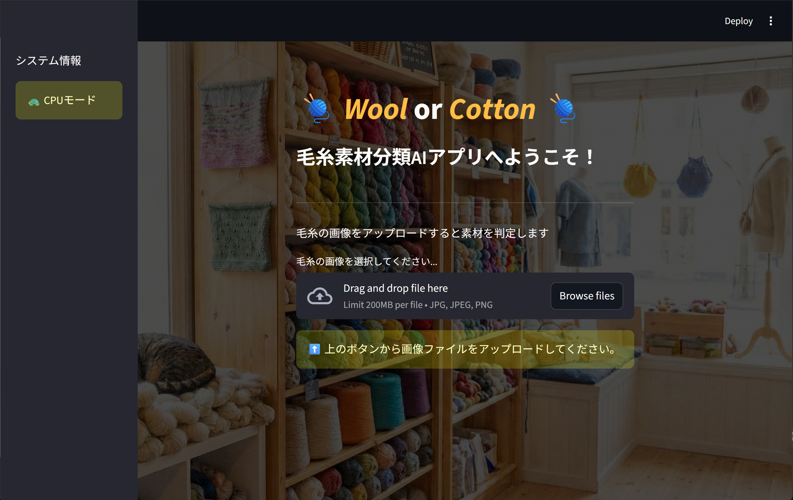
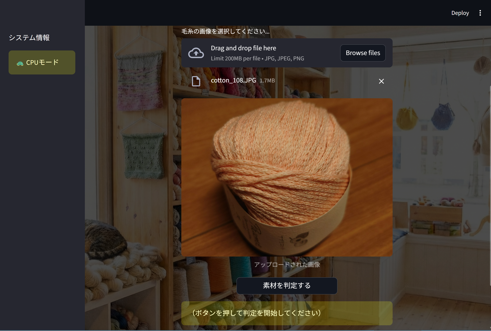
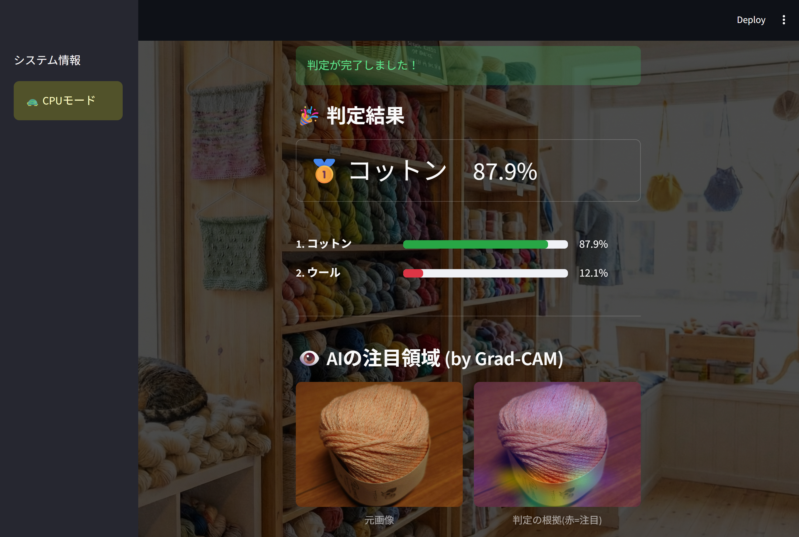

# 🧶YarnLens - 毛糸素材分類アプリ

- **毛糸素材の判別（ウール／コットン）ができるAIモデルを組み込んだアプリ「YarnLens」**

- 動物繊維の「ウール」と植物繊維の「コットン」の100%素材を画像認識で分類します。

### 🔗 [アプリを試してみる（Live Demo）] https://yarn-classifier.streamlit.app/

 

---

## 📋 アプリの概要

1. 画像アップロードによる素材解析：スマートフォンやPCから毛糸の写真をアップロードするだけで、AIが素材を推論。

2. 直感的なUI：Streamlitを採用し、誰でも迷わず操作できるシンプルな設計。

3. 「ウール」または「コットン」のクラスと、信頼度（例：82.5%）を表示。

4. 判断根拠を可視化するGrad-CAMを実装。

 
💻 動作イメージ

&nbsp;&nbsp;&nbsp;

左：画像アップロード画面 / 右：AIによる解析結果表示

---

## 🛠 技術スタック & 開発環境

- 言語：Python 3.12

- AIモデルの開発：Google Colab

- モデル開発のフレームワーク：TensorFlow/Keras

- フロントエンドの開発：VSCode

- GUI：Streamlit

- スマートフォンでの利用を想定し、軽量モデル（EfficientNet-B0）で転移学習。

- 独自の学習モデル：独自のデータセットを構築し、毛糸特有の質感を判別するためのモデルを構築。

- 判断根拠を可視化するGrad-CAMを実装。

 

---

## 📊 モデル構築の詳細（プロセス）
学習データセットの準備、ハイパーパラメータの調整、モデルの定義・学習および評価指標の推移については、以下のノートブックに詳細を記録しています。

* [**モデル構築ノートブック（Jupyter Notebook）**](./Yarn_Material_Classification_Model_ver_11302025.ipynb)

 

---

## 💡 開発の背景と想い

### 開発のきっかけ

「この糸ならこんなものが編めますよ」と提案してくれるような、創作のワクワクをサポートしてくれるアプリを作りたいと思ったのがきっかけです。その第一歩として、素材判別の核となるAIモデルを組み込んだ「YarnLens」を開発しました。

---

### 技術選定：TensorFlow/Keras への挑戦

受講した講座では PyTorch を扱いましたが、本プロジェクトではあえて TensorFlow/Keras を選択しました。

- 選定理由: 「デバッグは複雑だが、Webやモバイルへのデプロイにおいて実績と利便性が高い」という特性を、自らの手で経験したいと考えたためです。

- SEとしての視点: 開発効率だけでなく「本番運用を見据えた技術選定」を行うという、実務的なアプローチを重視しました。

---

### 開発目標と成果

**目標設定**

- 分類対象: 特徴が対照的な「ウール（動物繊維）」と「コットン（植物繊維）」の100%素材の識別。

- 目標精度: 実用ラインとして 75〜85% の正解率を目指す。

- データ設計: 限られたデータセットを最大限学習に活かすため、検証データ（Validation）を用いて精度を測定。

 

**学習結果**

- 達成精度: 94.2% （検証データにおける Accuracy）

- 評価: 100 Epochの学習を通じ、過学習を抑制しながら安定して目標を大きく上回る精度を達成することができました。

---

### 技術的な苦労と解決策：Grad-CAMの実装

AIの判断根拠を可視化する「Grad-CAM」の実装において、モデル構造の階層化（ネスト問題）に直面しました。

- 課題：使用した「EfficientNetB0」が1つの巨大なレイヤーとして扱われてしまい、内部の畳み込み層（top_activation層）にアクセスできない状態でした。

- 解決策：モデル構造を分析し、EfficientNetの中身を適切に展開するコード修正を行いました。

- 学び：フレームワークの仕様を深く理解し、ブラックボックス化を避けて内部構造を制御することの重要性を認識しました。
